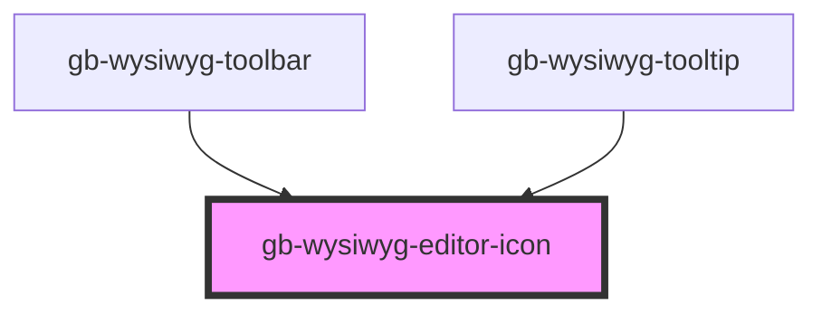

# gb-wysiwyg-editor-icon

<!-- Auto Generated Below -->

## Properties

| Property | Attribute | Description | Type                                                                                                    | Default     |
| -------- | --------- | ----------- | ------------------------------------------------------------------------------------------------------- | ----------- |
| `active` | `active`  |             | `boolean`                                                                                               | `undefined` |
| `state`  | `state`   |             | `"default" \| "disabled"`                                                                               | `'default'` |
| `type`   | `type`    |             | `"H1" \| "H2" \| "bold" \| "italic" \| "link" \| "list_bullet" \| "list_numbers" \| "photo" \| "quote"` | `undefined` |

## Dependencies

### Used by

 - [gb-wysiwyg-toolbar](../gb-WYSIWYG-toolbar)
 - [gb-wysiwyg-tooltip](../gb-WYSIWYG-tooltip)

### Graph

----------------------------------------------

*Built with [StencilJS](https://stenciljs.com/)*
