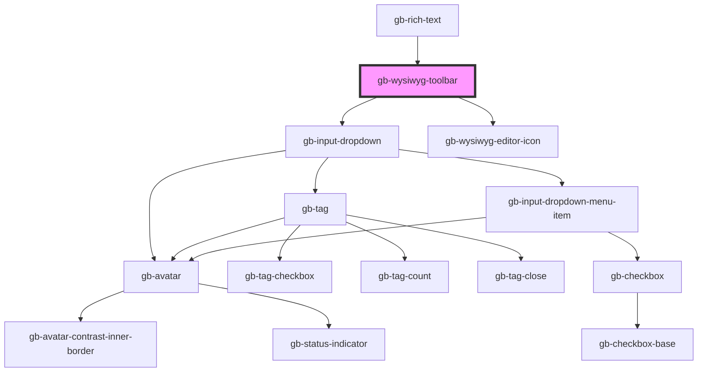

# gb-wysiwyg-toolbar

<!-- Auto Generated Below -->

## Properties

| Property       | Attribute       | Description | Type                    | Default     |
| -------------- | --------------- | ----------- | ----------------------- | ----------- |
| `bold`         | `bold`          |             | `boolean`               | `undefined` |
| `breakpoint`   | `breakpoint`    |             | `"desktop" \| "mobile"` | `undefined` |
| `bulletList`   | `bullet-list`   |             | `boolean`               | `undefined` |
| `fontSelector` | `font-selector` |             | `boolean`               | `undefined` |
| `h1`           | `h-1`           |             | `boolean`               | `undefined` |
| `h2`           | `h-2`           |             | `boolean`               | `undefined` |
| `image`        | `image`         |             | `boolean`               | `undefined` |
| `italic`       | `italic`        |             | `boolean`               | `undefined` |
| `link`         | `link`          |             | `boolean`               | `undefined` |
| `numberList`   | `number-list`   |             | `boolean`               | `undefined` |
| `quote`        | `quote`         |             | `boolean`               | `undefined` |

## Dependencies

### Used by

 - [gb-rich-text](../gb-rich-text)

### Depends on

- [gb-input-dropdown](../gb-input-dropdown)
- [gb-wysiwyg-editor-icon](../gb-WYSIWYG editor-icon)

### Graph

----------------------------------------------

*Built with [StencilJS](https://stenciljs.com/)*
