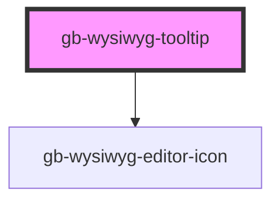

# gb-wysiwyg-tooltip

<!-- Auto Generated Below -->

## Properties

| Property     | Attribute    | Description | Type                            | Default     |
| ------------ | ------------ | ----------- | ------------------------------- | ----------- |
| `arrow`      | `arrow`      |             | `"center" \| "left" \| "right"` | `undefined` |
| `breakpoint` | `breakpoint` |             | `"default" \| "mobile"`         | `undefined` |

## Dependencies

### Depends on

- [gb-wysiwyg-editor-icon](../gb-WYSIWYG editor-icon)

### Graph

----------------------------------------------

*Built with [StencilJS](https://stenciljs.com/)*
