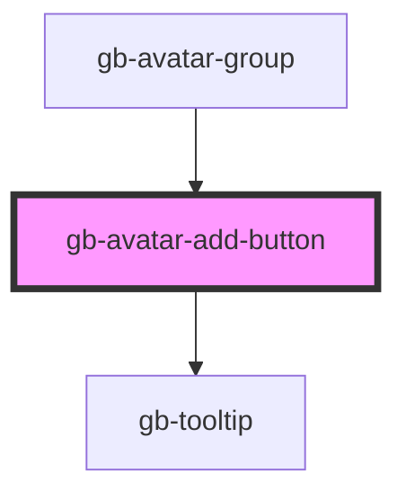

# avatar-add-button

<!-- Auto Generated Below -->

## Properties

| Property      | Attribute       | Description | Type                                                                                                                       | Default     |
| ------------- | --------------- | ----------- | -------------------------------------------------------------------------------------------------------------------------- | ----------- |
| `el`          | --              |             | `HTMLElement`                                                                                                              | `undefined` |
| `showToolTip` | `show-tool-tip` |             | `boolean`                                                                                                                  | `false`     |
| `size`        | `size`          |             | `"lg" \| "md" \| "profile_lg" \| "profile_md" \| "profile_sm" \| "sm" \| "xl" \| "xl2" \| "xl3" \| "xl4" \| "xs" \| "xxs"` | `undefined` |
| `state`       | `state`         |             | `StateEnum.Default \| StateEnum.Disabled`                                                                                  | `undefined` |

## Dependencies

### Used by

 - [gb-avatar-group](../gb-avatar-group)

### Depends on

- [gb-tooltip](../gb-tooltip)

### Graph

----------------------------------------------

*Built with [StencilJS](https://stenciljs.com/)*
