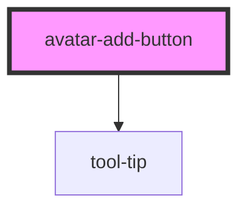

# avatar-add-button

<!-- Auto Generated Below -->

## Properties

| Property      | Attribute       | Description | Type                                                                       | Default     |
| ------------- | --------------- | ----------- | -------------------------------------------------------------------------- | ----------- |
| `showToolTip` | `show-tool-tip` |             | `boolean`                                                                  | `false`     |
| `size`        | `size`          |             | `"fourxl" \| "lg" \| "md" \| "sm" \| "threexl" \| "twoxl" \| "xl" \| "xs"` | `undefined` |
| `state`       | `state`         |             | `StateEnum.Active \| StateEnum.Disabled`                                   | `undefined` |

## Dependencies

### Depends on

- [tool-tip](../tool-tip)

### Graph

----------------------------------------------

*Built with [StencilJS](https://stenciljs.com/)*
