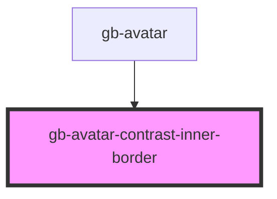

# avatar-contrast-inner-border

<!-- Auto Generated Below -->

## Properties

| Property     | Attribute     | Description | Type                                                                                                              | Default     |
| ------------ | ------------- | ----------- | ----------------------------------------------------------------------------------------------------------------- | ----------- |
| `borderSize` | `border-size` |             | `"lg" \| "md" \| "profile_lg" \| "profile_md" \| "profile_sm" \| "sm" \| "xl" \| "xl2" \| "xl3" \| "xl4" \| "xs"` | `undefined` |
| `weight`     | `weight`      |             | `BorderWeights.Heavy \| BorderWeights.Light \| BorderWeights.Regular`                                             | `undefined` |

## Dependencies

### Used by

 - [gb-avatar](../gb-avatar)

### Graph

----------------------------------------------

*Built with [StencilJS](https://stenciljs.com/)*
