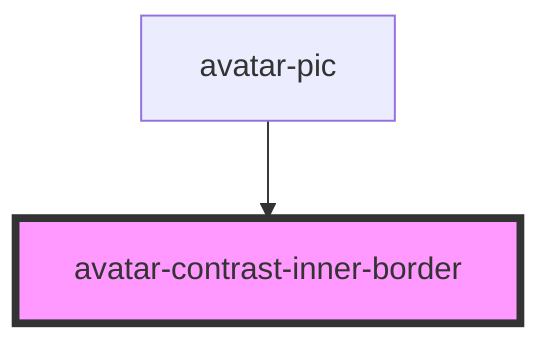

# avatar-contrast-inner-border

<!-- Auto Generated Below -->

## Properties

| Property     | Attribute     | Description | Type                                                                       | Default     |
| ------------ | ------------- | ----------- | -------------------------------------------------------------------------- | ----------- |
| `borderSize` | `border-size` |             | `"fourxl" \| "lg" \| "md" \| "sm" \| "threexl" \| "twoxl" \| "xl" \| "xs"` | `undefined` |
| `weight`     | `weight`      |             | `"heavy" \| "light" \| "regular"`                                          | `undefined` |

## Dependencies

### Used by

 - [avatar-pic](../avatar-pic)

### Graph

----------------------------------------------

*Built with [StencilJS](https://stenciljs.com/)*
