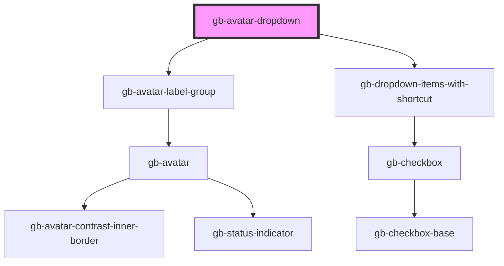

# gb-avatar-dropdown

<!-- Auto Generated Below -->

## Properties

| Property         | Attribute          | Description | Type                                                                      | Default     |
| ---------------- | ------------------ | ----------- | ------------------------------------------------------------------------- | ----------- |
| `color`          | `color`            |             | `"blue" \| "cyan" \| "gray" \| "green" \| "pink" \| "purple" \| "yellow"` | `undefined` |
| `listGroupOne`   | `list-group-one`   |             | `boolean`                                                                 | `undefined` |
| `listGroupThree` | `list-group-three` |             | `boolean`                                                                 | `undefined` |
| `listGroupTwo`   | `list-group-two`   |             | `boolean`                                                                 | `undefined` |
| `showDarkTheme`  | `show-dark-theme`  |             | `boolean`                                                                 | `undefined` |
| `showLogOut`     | `show-log-out`     |             | `boolean`                                                                 | `undefined` |
| `showProfile`    | `show-profile`     |             | `boolean`                                                                 | `undefined` |
| `text`           | `text`             |             | `boolean`                                                                 | `false`     |
| `type`           | `type`             |             | `"complex" \| "simple"`                                                   | `undefined` |

## Methods

### `logoutClicked() => Promise<void>`

#### Returns

Type: `Promise<void>`

### `viewProfileClicked() => Promise<void>`

#### Returns

Type: `Promise<void>`

## Dependencies

### Depends on

- [gb-avatar-label-group](../gb-avatar-label-group)
- [gb-dropdown-items-with-shortcut](../gb-dropdown-items-with-shortcut)

### Graph

----------------------------------------------

*Built with [StencilJS](https://stenciljs.com/)*
