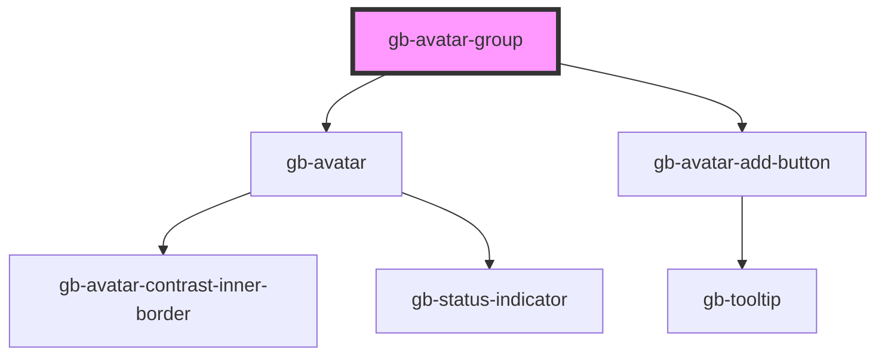

# gb-avatar-group

<!-- Auto Generated Below -->

## Properties

| Property        | Attribute         | Description | Type                                                                                                              | Default            |
| --------------- | ----------------- | ----------- | ----------------------------------------------------------------------------------------------------------------- | ------------------ |
| `addMoreButton` | `add-more-button` |             | `boolean`                                                                                                         | `undefined`        |
| `moreUser`      | `more-user`       |             | `boolean`                                                                                                         | `undefined`        |
| `size`          | `size`            |             | `"lg" \| "md" \| "profile_lg" \| "profile_md" \| "profile_sm" \| "sm" \| "xl" \| "xl2" \| "xl3" \| "xl4" \| "xs"` | `undefined`        |
| `state`         | `state`           |             | `StateEnum.Active \| StateEnum.Disabled`                                                                          | `StateEnum.Active` |
| `text`          | `text`            |             | `boolean`                                                                                                         | `true`             |

## Dependencies

### Depends on

- [gb-avatar](../gb-avatar)
- [gb-avatar-add-button](../gb-avatar-add-button)

### Graph

----------------------------------------------

*Built with [StencilJS](https://stenciljs.com/)*
