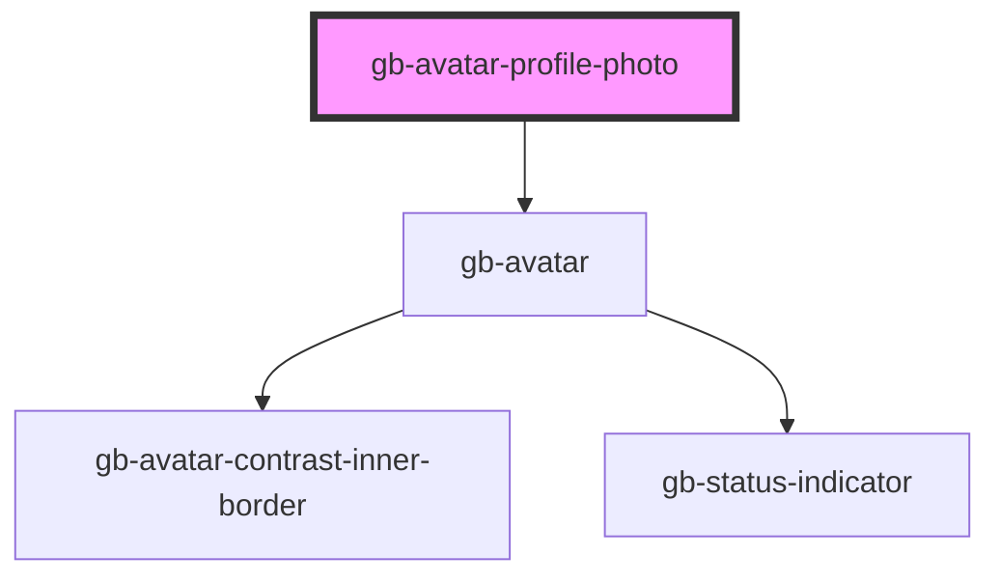

# avatar-profile-photo

<!-- Auto Generated Below -->

## Properties

| Property      | Attribute     | Description | Type                                                                                                              | Default     |
| ------------- | ------------- | ----------- | ----------------------------------------------------------------------------------------------------------------- | ----------- |
| `icon`        | `icon`        |             | `string`                                                                                                          | `'user'`    |
| `placeholder` | `placeholder` |             | `boolean`                                                                                                         | `false`     |
| `size`        | `size`        |             | `"lg" \| "md" \| "profile_lg" \| "profile_md" \| "profile_sm" \| "sm" \| "xl" \| "xl2" \| "xl3" \| "xl4" \| "xs"` | `undefined` |
| `text`        | `text`        |             | `boolean`                                                                                                         | `false`     |
| `verified`    | `verified`    |             | `boolean`                                                                                                         | `false`     |

## Dependencies

### Depends on

- [gb-avatar](../gb-avatar)

### Graph

----------------------------------------------

*Built with [StencilJS](https://stenciljs.com/)*
