# avatar-profile-photo

<!-- Auto Generated Below -->

## Properties

| Property      | Attribute     | Description | Type                                                                                                              | Default                        |
| ------------- | ------------- | ----------- | ----------------------------------------------------------------------------------------------------------------- | ------------------------------ |
| `placeholder` | `placeholder` |             | `boolean`                                                                                                         | `false`                        |
| `size`        | `size`        |             | `"lg" \| "md" \| "profile_lg" \| "profile_md" \| "profile_sm" \| "sm" \| "xl" \| "xl2" \| "xl3" \| "xl4" \| "xs"` | `undefined`                    |
| `state`       | `state`       |             | `OnlineIndicatorStates.Offline \| OnlineIndicatorStates.Online`                                                   | `OnlineIndicatorStates.Online` |
| `statusIcon`  | `status-icon` |             | `string`                                                                                                          | `''`                           |
| `text`        | `text`        |             | `boolean`                                                                                                         | `false`                        |

## Dependencies

### Depends on

- [gb-avatar](../gb-avatar)

### Graph

```mermaid
graph TD;
  gb-avatar-profile-photo --> gb-avatar
  gb-avatar --> gb-avatar-contrast-inner-border
  gb-avatar --> gb-status-indicator
  style gb-avatar-profile-photo fill:#f9f,stroke:#333,stroke-width:4px
```

----------------------------------------------

*Built with [StencilJS](https://stenciljs.com/)*
