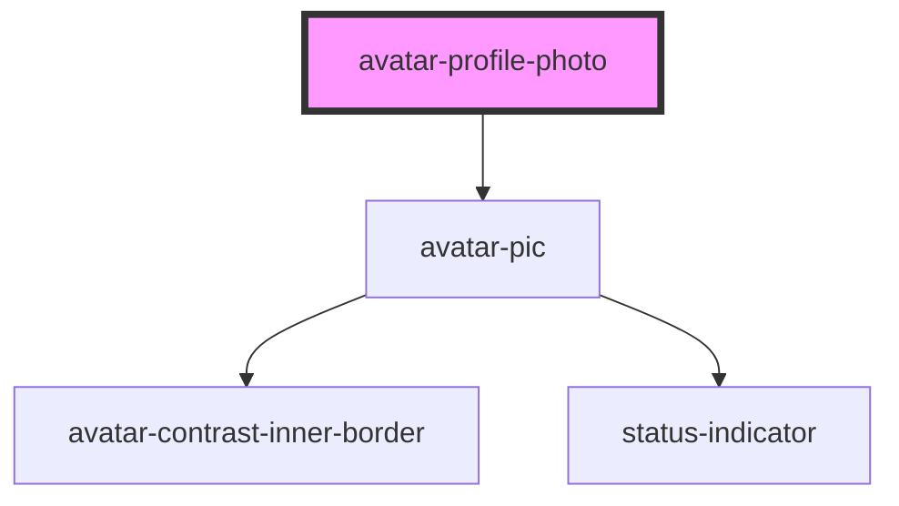

# avatar-profile-photo

<!-- Auto Generated Below -->

## Properties

| Property      | Attribute     | Description | Type                                                                       | Default     |
| ------------- | ------------- | ----------- | -------------------------------------------------------------------------- | ----------- |
| `placeholder` | `placeholder` |             | `boolean`                                                                  | `false`     |
| `size`        | `size`        |             | `"fourxl" \| "lg" \| "md" \| "sm" \| "threexl" \| "twoxl" \| "xl" \| "xs"` | `undefined` |
| `state`       | `state`       |             | `"offline" \| "online"`                                                    | `'online'`  |
| `statusIcon`  | `status-icon` |             | `string`                                                                   | `''`        |
| `text`        | `text`        |             | `boolean`                                                                  | `false`     |
| `weight`      | `weight`      |             | `"heavy" \| "light" \| "regular"`                                          | `'regular'` |

## Dependencies

### Depends on

- [avatar-pic](../avatar-pic)

### Graph

----------------------------------------------

*Built with [StencilJS](https://stenciljs.com/)*
