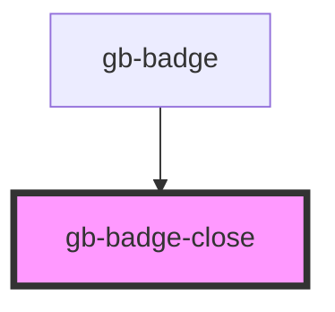

# gb-badge-close

<!-- Auto Generated Below -->

## Properties

| Property | Attribute | Description | Type                                                                                                             | Default     |
| -------- | --------- | ----------- | ---------------------------------------------------------------------------------------------------------------- | ----------- |
| `color`  | `color`   |             | `"discovery" \| "error" \| "gray" \| "information" \| "pink" \| "primary" \| "purple" \| "success" \| "warning"` | `undefined` |
| `type`   | `type`    |             | `"rounded" \| "square"`                                                                                          | `undefined` |

## Dependencies

### Used by

 - [gb-badge](../gb-badges)

### Graph

----------------------------------------------

*Built with [StencilJS](https://stenciljs.com/)*
