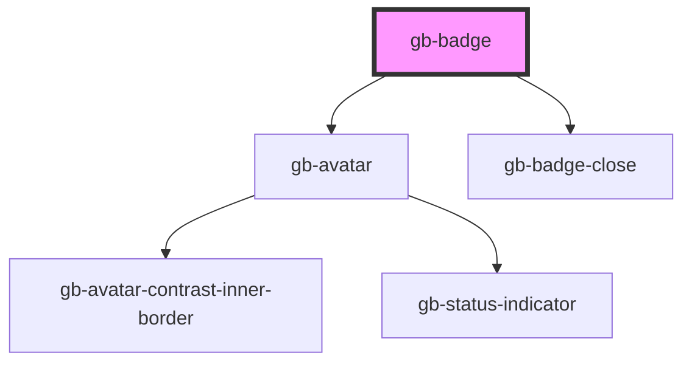

# gb-badge

<!-- Auto Generated Below -->

## Properties

| Property          | Attribute           | Description | Type                                                                                                              | Default     |
| ----------------- | ------------------- | ----------- | ----------------------------------------------------------------------------------------------------------------- | ----------- |
| `closeButton`     | `close-button`      |             | `boolean`                                                                                                         | `false`     |
| `color`           | `color`             |             | `"discovery" \| "error" \| "gray" \| "information" \| "pink" \| "primary" \| "purple" \| "success" \| "warning"`  | `undefined` |
| `icon`            | `icon`              |             | `"avatar" \| "country" \| "dot" \| "icon_leading" \| "icon_trailing" \| "only"`                                   | `undefined` |
| `iconLeadingSrc`  | `icon-leading-src`  |             | `string`                                                                                                          | `undefined` |
| `iconTrailingSrc` | `icon-trailing-src` |             | `string`                                                                                                          | `undefined` |
| `size`            | `size`              |             | `"lg" \| "md" \| "profile_lg" \| "profile_md" \| "profile_sm" \| "sm" \| "xl" \| "xl2" \| "xl3" \| "xl4" \| "xs"` | `undefined` |
| `type`            | `type`              |             | `"badge_color" \| "badge_modern" \| "pill_color" \| "pill_outline"`                                               | `undefined` |

## Dependencies

### Depends on

- [gb-avatar](../gb-avatar)
- [gb-badge-close](../gb-badge-close)

### Graph

----------------------------------------------

*Built with [StencilJS](https://stenciljs.com/)*
