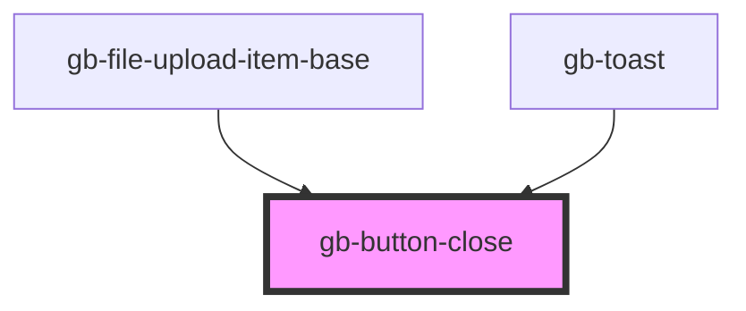

# button-close

<!-- Auto Generated Below -->

## Properties

| Property | Attribute | Description | Type                                                                                                                          | Default     |
| -------- | --------- | ----------- | ----------------------------------------------------------------------------------------------------------------------------- | ----------- |
| `color`  | `color`   |             | `"default" \| "discovery" \| "error" \| "gray" \| "information" \| "pink" \| "primary" \| "purple" \| "success" \| "warning"` | `undefined` |
| `size`   | `size`    |             | `"lg" \| "md" \| "profile_lg" \| "profile_md" \| "profile_sm" \| "sm" \| "xl" \| "xl2" \| "xl3" \| "xl4" \| "xs" \| "xxs"`    | `undefined` |

## Dependencies

### Used by

 - [gb-file-upload-item-base](../gb-file-upload-item-base)
 - [gb-toast](../gb-toast)

### Graph

----------------------------------------------

*Built with [StencilJS](https://stenciljs.com/)*
