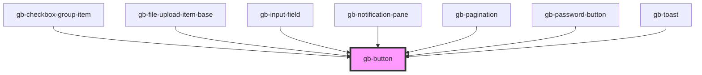

# test-button

<!-- Auto Generated Below -->

## Properties

| Property           | Attribute            | Description | Type                                                                                                                       | Default     |
| ------------------ | -------------------- | ----------- | -------------------------------------------------------------------------------------------------------------------------- | ----------- |
| `destructive`      | `destructive`        |             | `boolean`                                                                                                                  | `false`     |
| `hierarchy`        | `hierarchy`          |             | `"link_color" \| "link_gray" \| "primary" \| "secondary_color" \| "secondary_gray" \| "tertiary_color" \| "tertiary_gray"` | `undefined` |
| `icon`             | `icon`               |             | `"default" \| "only"`                                                                                                      | `undefined` |
| `iconLeading`      | `icon-leading`       |             | `boolean`                                                                                                                  | `false`     |
| `iconLeadingSwap`  | `icon-leading-swap`  |             | `string`                                                                                                                   | `undefined` |
| `iconTrailing`     | `icon-trailing`      |             | `boolean`                                                                                                                  | `false`     |
| `iconTrailingSwap` | `icon-trailing-swap` |             | `string`                                                                                                                   | `undefined` |
| `size`             | `size`               |             | `"lg" \| "md" \| "profile_lg" \| "profile_md" \| "profile_sm" \| "sm" \| "xl" \| "xl2" \| "xl3" \| "xl4" \| "xs" \| "xxs"` | `undefined` |
| `state`            | `state`              |             | `"default" \| "disabled"`                                                                                                  | `undefined` |

## Dependencies

### Used by

 - [gb-checkbox-group-item](../gb-checkbox-group-item)
 - [gb-file-upload-item-base](../gb-file-upload-item-base)
 - [gb-input-field](../gb-input-field)
 - [gb-notification-pane](../gb-notification-pane)
 - [gb-pagination](../gb-pagination)
 - [gb-password-button](../gb-password-button)
 - [gb-toast](../gb-toast)

### Graph

----------------------------------------------

*Built with [StencilJS](https://stenciljs.com/)*
