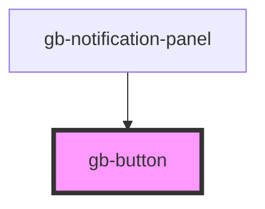

# button-cta

<!-- Auto Generated Below -->

## Properties

| Property    | Attribute    | Description | Type                                                                                                                       | Default     |
| ----------- | ------------ | ----------- | -------------------------------------------------------------------------------------------------------------------------- | ----------- |
| `disabled`  | `disabled`   |             | `boolean`                                                                                                                  | `false`     |
| `hierarchy` | `hierarchy`  |             | `"link-color" \| "link-gray" \| "primary" \| "secondary-color" \| "secondary-gray" \| "tertiary-color" \| "tertiary-gray"` | `undefined` |
| `leftIcon`  | `left-icon`  |             | `string`                                                                                                                   | `undefined` |
| `rightIcon` | `right-icon` |             | `string`                                                                                                                   | `undefined` |
| `size`      | `size`       |             | `"lg" \| "md" \| "profile_lg" \| "profile_md" \| "profile_sm" \| "sm" \| "xl" \| "xl2" \| "xl3" \| "xl4" \| "xs"`          | `'xl'`      |

## Dependencies

### Used by

 - [gb-notification-panel](../gb-notification-panel)

### Graph

----------------------------------------------

*Built with [StencilJS](https://stenciljs.com/)*
