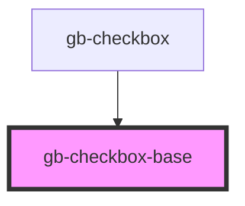

# check-box

<!-- Auto Generated Below -->

## Properties

| Property        | Attribute       | Description | Type                                                                                                              | Default     |
| --------------- | --------------- | ----------- | ----------------------------------------------------------------------------------------------------------------- | ----------- |
| `checked`       | `checked`       |             | `boolean`                                                                                                         | `false`     |
| `indeterminate` | `indeterminate` |             | `boolean`                                                                                                         | `false`     |
| `size`          | `size`          |             | `"lg" \| "md" \| "profile_lg" \| "profile_md" \| "profile_sm" \| "sm" \| "xl" \| "xl2" \| "xl3" \| "xl4" \| "xs"` | `undefined` |
| `state`         | `state`         |             | `CheckBoxStates.Default \| CheckBoxStates.Disabled`                                                               | `undefined` |
| `type`          | `type`          |             | `"check_circle" \| "checkbox" \| "radio"`                                                                         | `undefined` |

## Dependencies

### Used by

 - [gb-checkbox](../gb-checkbox)

### Graph

----------------------------------------------

*Built with [StencilJS](https://stenciljs.com/)*
