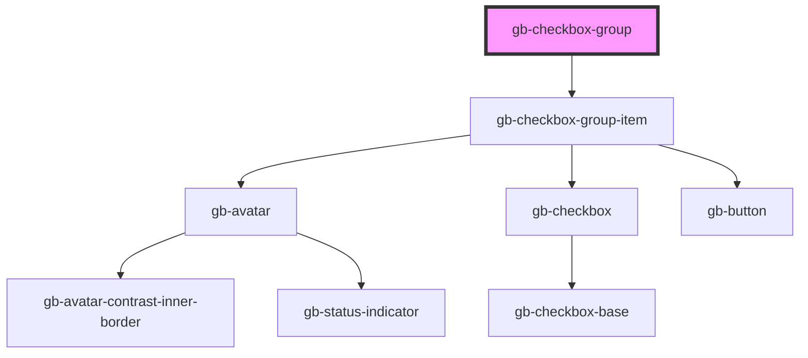

# gb-checkbox-group

<!-- Auto Generated Below -->

## Properties

| Property     | Attribute    | Description | Type                                                                                                                       | Default     |
| ------------ | ------------ | ----------- | -------------------------------------------------------------------------------------------------------------------------- | ----------- |
| `breakpoint` | `breakpoint` |             | `"desktop" \| "mobile"`                                                                                                    | `undefined` |
| `icon`       | `icon`       |             | `string`                                                                                                                   | `''`        |
| `selected`   | `selected`   |             | `boolean`                                                                                                                  | `false`     |
| `size`       | `size`       |             | `"lg" \| "md" \| "profile_lg" \| "profile_md" \| "profile_sm" \| "sm" \| "xl" \| "xl2" \| "xl3" \| "xl4" \| "xs" \| "xxs"` | `undefined` |
| `type`       | `type`       |             | `"avatar" \| "checkbox" \| "icon_simple" \| "payment_icon" \| "radio_button"`                                              | `undefined` |

## Dependencies

### Depends on

- [gb-checkbox-group-item](../gb-checkbox-group-item)

### Graph

----------------------------------------------

*Built with [StencilJS](https://stenciljs.com/)*
