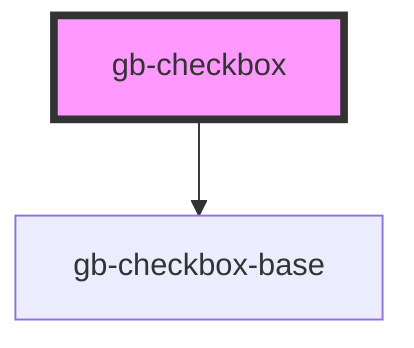

# gb-checkbox

<!-- Auto Generated Below -->

## Properties

| Property         | Attribute         | Description | Type                                                                                                              | Default     |
| ---------------- | ----------------- | ----------- | ----------------------------------------------------------------------------------------------------------------- | ----------- |
| `checked`        | `checked`         |             | `boolean`                                                                                                         | `false`     |
| `indeterminate`  | `indeterminate`   |             | `boolean`                                                                                                         | `false`     |
| `size`           | `size`            |             | `"lg" \| "md" \| "profile_lg" \| "profile_md" \| "profile_sm" \| "sm" \| "xl" \| "xl2" \| "xl3" \| "xl4" \| "xs"` | `undefined` |
| `state`          | `state`           |             | `CheckBoxStates.Default \| CheckBoxStates.Disabled`                                                               | `undefined` |
| `supportingText` | `supporting-text` |             | `boolean`                                                                                                         | `false`     |
| `type`           | `type`            |             | `"check_circle" \| "checkbox" \| "radio"`                                                                         | `undefined` |

## Dependencies

### Depends on

- [gb-checkbox-base](../gb-checkbox-base)

### Graph

----------------------------------------------

*Built with [StencilJS](https://stenciljs.com/)*
