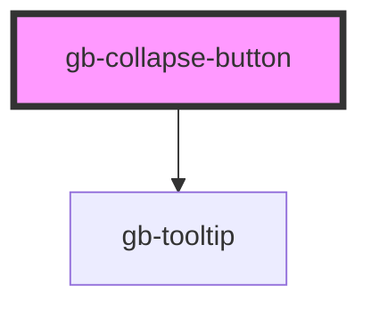

# collapse-button

<!-- Auto Generated Below -->

## Properties

| Property      | Attribute      | Description | Type                | Default      |
| ------------- | -------------- | ----------- | ------------------- | ------------ |
| `action`      | `action`       |             | `string`            | `'collapse'` |
| `color`       | `color`        |             | `"gray" \| "white"` | `undefined`  |
| `isCollapsed` | `is-collapsed` |             | `boolean`           | `false`      |
| `isHovered`   | `is-hovered`   |             | `boolean`           | `false`      |

## Methods

### `collapseSidebar() => Promise<void>`

#### Returns

Type: `Promise<void>`

### `expandSidebar() => Promise<void>`

#### Returns

Type: `Promise<void>`

## Dependencies

### Depends on

- [gb-tooltip](../gb-tooltip)

### Graph

----------------------------------------------

*Built with [StencilJS](https://stenciljs.com/)*
