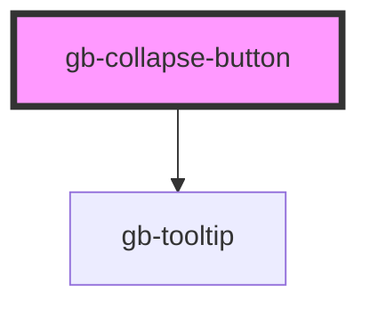

# collapse-button

<!-- Auto Generated Below -->

## Properties

| Property               | Attribute                | Description | Type                | Default     |
| ---------------------- | ------------------------ | ----------- | ------------------- | ----------- |
| `color`                | `color`                  |             | `"grey" \| "white"` | `undefined` |
| `currentIconDirection` | `current-icon-direction` |             | `string`            | `'left'`    |
| `isHovered`            | `is-hovered`             |             | `boolean`           | `false`     |

## Dependencies

### Depends on

- [gb-tooltip](../gb-tooltip)

### Graph

----------------------------------------------

*Built with [StencilJS](https://stenciljs.com/)*
