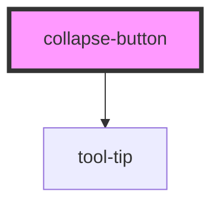

# collapse-button

<!-- Auto Generated Below -->

## Properties

| Property               | Attribute                | Description | Type      | Default  |
| ---------------------- | ------------------------ | ----------- | --------- | -------- |
| `currentIconDirection` | `current-icon-direction` |             | `string`  | `'left'` |
| `isHovered`            | `is-hovered`             |             | `boolean` | `false`  |

## Dependencies

### Depends on

- [tool-tip](../tool-tip)

### Graph

----------------------------------------------

*Built with [StencilJS](https://stenciljs.com/)*
