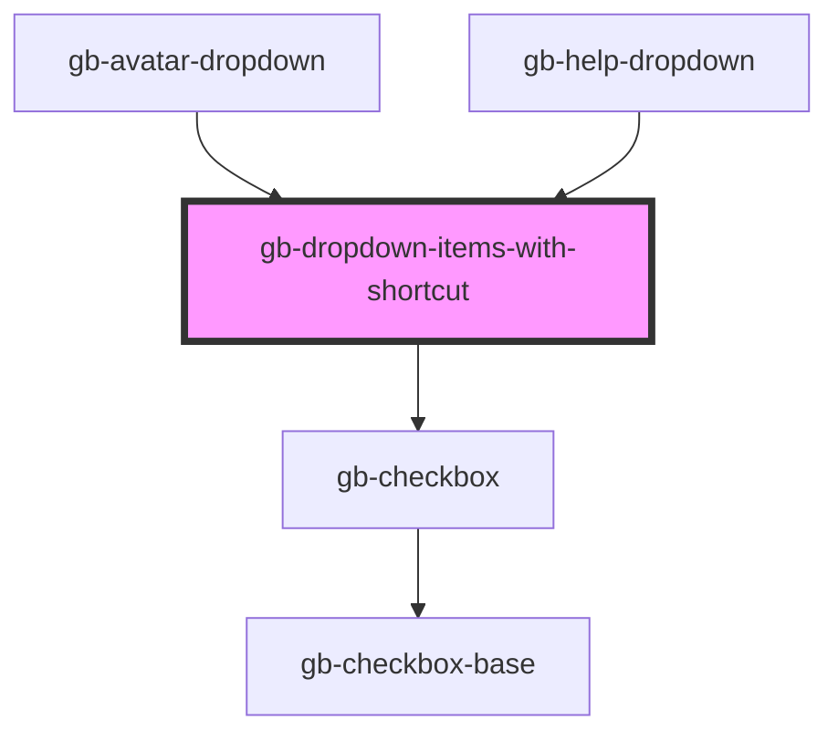

# gb-dropdown-items-with-shortcut

<!-- Auto Generated Below -->

## Properties

| Property       | Attribute       | Description | Type                      | Default     |
| -------------- | --------------- | ----------- | ------------------------- | ----------- |
| `checkbox`     | `checkbox`      |             | `boolean`                 | `false`     |
| `icon`         | `icon`          |             | `boolean`                 | `false`     |
| `iconSrc`      | `icon-src`      |             | `string`                  | `undefined` |
| `label`        | `label`         |             | `string`                  | `''`        |
| `shortcut`     | `shortcut`      |             | `boolean`                 | `undefined` |
| `shortcutIcon` | `shortcut-icon` |             | `string`                  | `'C'`       |
| `state`        | `state`         |             | `"default" \| "disabled"` | `'default'` |

## Dependencies

### Used by

 - [gb-avatar-dropdown](../gb-avatar-dropdown)
 - [gb-help-dropdown](../gb-help-dropdown)

### Depends on

- [gb-checkbox](../gb-checkbox)

### Graph

----------------------------------------------

*Built with [StencilJS](https://stenciljs.com/)*
