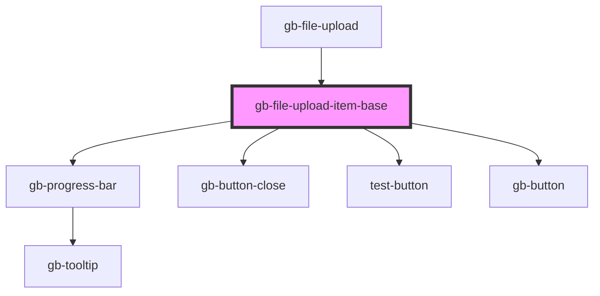

# gb-file-upload-item-base

<!-- Auto Generated Below -->

## Properties

| Property      | Attribute      | Description | Type                                                                                                              | Default             |
| ------------- | -------------- | ----------- | ----------------------------------------------------------------------------------------------------------------- | ------------------- |
| `buttonState` | `button-state` |             | `StateEnum.Default \| StateEnum.Disabled`                                                                         | `StateEnum.Default` |
| `fileType`    | `file-type`    |             | `"doc" \| "jpg" \| "mp4" \| "pdf" \| "png"`                                                                       | `undefined`         |
| `heightSize`  | `height-size`  |             | `"lg" \| "md" \| "profile_lg" \| "profile_md" \| "profile_sm" \| "sm" \| "xl" \| "xl2" \| "xl3" \| "xl4" \| "xs"` | `'md'`              |
| `icon`        | `icon`         |             | `"icon" \| "outline"`                                                                                             | `undefined`         |
| `state`       | `state`        |             | `"complete" \| "default" \| "disabled" \| "error" \| "hover" \| "in_progress"`                                    | `undefined`         |

## Dependencies

### Used by

 - [gb-file-upload](../gb-file-upload)

### Depends on

- [gb-progress-bar](../gb-progress-bar)
- [gb-button-close](../gb-button-close)
- [test-button](../test-button)
- [gb-button](../gb-button)

### Graph

----------------------------------------------

*Built with [StencilJS](https://stenciljs.com/)*
