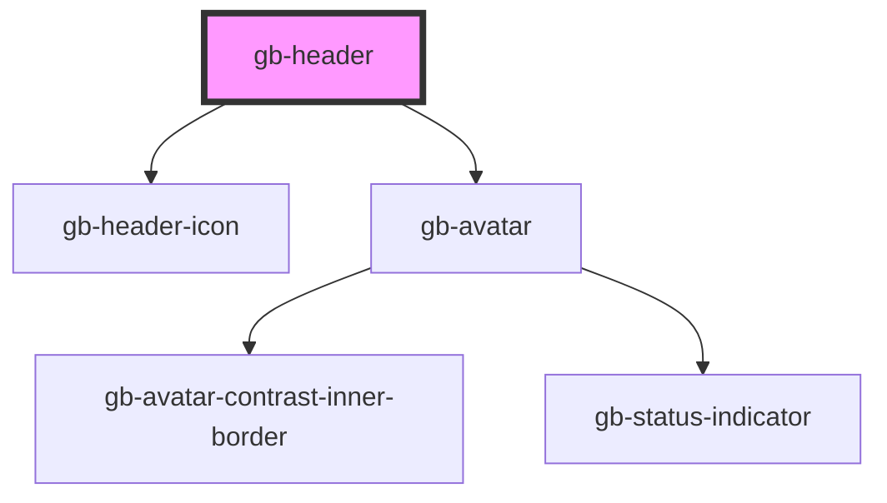

# gb-header

<!-- Auto Generated Below -->

## Properties

| Property        | Attribute        | Description | Type                                      | Default     |
| --------------- | ---------------- | ----------- | ----------------------------------------- | ----------- |
| `placeholder`   | `placeholder`    |             | `boolean`                                 | `false`     |
| `showIndicator` | `show-indicator` |             | `boolean`                                 | `false`     |
| `state`         | `state`          |             | `StateEnum.Default \| StateEnum.Disabled` | `undefined` |
| `text`          | `text`           |             | `boolean`                                 | `false`     |

## Dependencies

### Depends on

- [gb-header-icon](../gb-header-icon)
- [gb-avatar](../gb-avatar)

### Graph

----------------------------------------------

*Built with [StencilJS](https://stenciljs.com/)*
