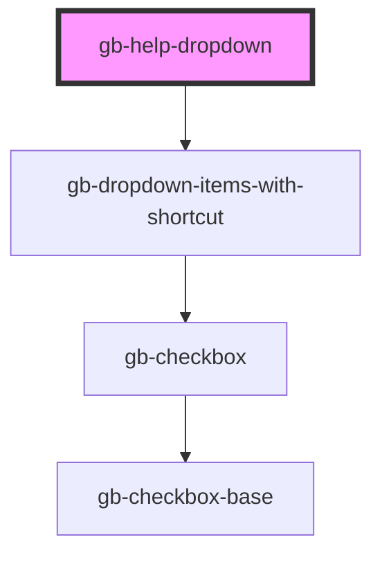

# gb-help-dropdown

<!-- Auto Generated Below -->

## Properties

| Property       | Attribute        | Description | Type      | Default     |
| -------------- | ---------------- | ----------- | --------- | ----------- |
| `showLogError` | `show-log-error` |             | `boolean` | `undefined` |

## Dependencies

### Depends on

- [gb-dropdown-items-with-shortcut](../gb-dropdown-items-with-shortcut)

### Graph

----------------------------------------------

*Built with [StencilJS](https://stenciljs.com/)*
