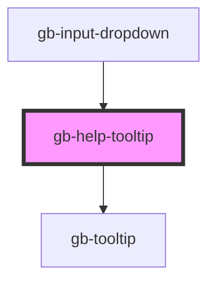

# gb-help-tooltip

<!-- Auto Generated Below -->

## Properties

| Property             | Attribute              | Description | Type      | Default |
| -------------------- | ---------------------- | ----------- | --------- | ------- |
| `showArrow`          | `show-arrow`           |             | `boolean` | `false` |
| `showSupportingText` | `show-supporting-text` |             | `boolean` | `false` |

## Dependencies

### Used by

 - [gb-input-dropdown](../gb-input-dropdown)

### Depends on

- [gb-tooltip](../gb-tooltip)

### Graph

----------------------------------------------

*Built with [StencilJS](https://stenciljs.com/)*
