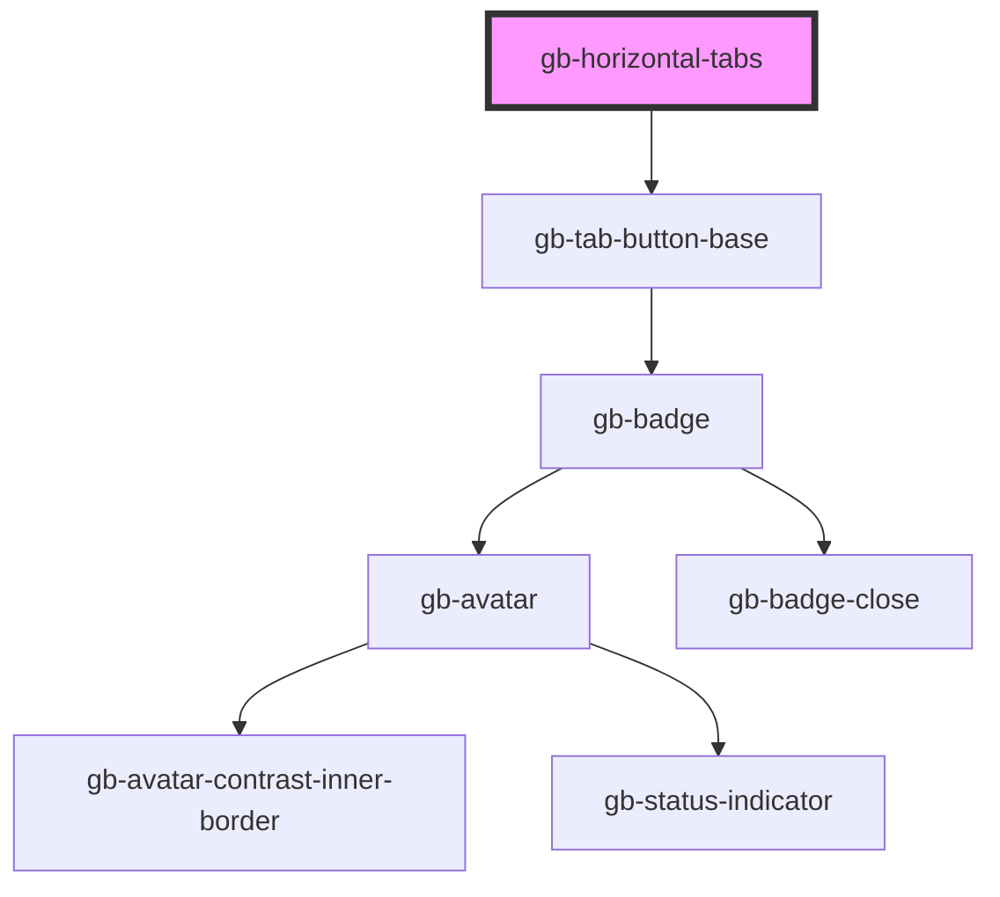

# gb-horizontal-tabs

<!-- Auto Generated Below -->

## Properties

| Property         | Attribute          | Description | Type                                                                                                                                                                                     | Default     |
| ---------------- | ------------------ | ----------- | ---------------------------------------------------------------------------------------------------------------------------------------------------------------------------------------- | ----------- |
| `breakpoint`     | `breakpoint`       |             | `"desktop" \| "mobile"`                                                                                                                                                                  | `undefined` |
| `eighthTab`      | `eighth-tab`       |             | `boolean`                                                                                                                                                                                | `false`     |
| `eighthTabName`  | `eighth-tab-name`  |             | `string`                                                                                                                                                                                 | `''`        |
| `fifthTab`       | `fifth-tab`        |             | `boolean`                                                                                                                                                                                | `false`     |
| `fifthTabName`   | `fifth-tab-name`   |             | `string`                                                                                                                                                                                 | `''`        |
| `firstTabName`   | `first-tab-name`   |             | `string`                                                                                                                                                                                 | `''`        |
| `fourthTab`      | `fourth-tab`       |             | `boolean`                                                                                                                                                                                | `false`     |
| `fourthTabName`  | `fourth-tab-name`  |             | `string`                                                                                                                                                                                 | `''`        |
| `fullWidth`      | `full-width`       |             | `boolean`                                                                                                                                                                                | `false`     |
| `ninthTab`       | `ninth-tab`        |             | `boolean`                                                                                                                                                                                | `false`     |
| `ninthTabName`   | `ninth-tab-name`   |             | `string`                                                                                                                                                                                 | `''`        |
| `secondTabName`  | `second-tab-name`  |             | `string`                                                                                                                                                                                 | `''`        |
| `seventhTab`     | `seventh-tab`      |             | `boolean`                                                                                                                                                                                | `false`     |
| `seventhTabName` | `seventh-tab-name` |             | `string`                                                                                                                                                                                 | `''`        |
| `sixthTab`       | `sixth-tab`        |             | `boolean`                                                                                                                                                                                | `false`     |
| `sixthTabName`   | `sixth-tab-name`   |             | `string`                                                                                                                                                                                 | `''`        |
| `size`           | `size`             |             | `"lg" \| "md" \| "profile_lg" \| "profile_md" \| "profile_sm" \| "sm" \| "xl" \| "xl2" \| "xl3" \| "xl4" \| "xs" \| "xxs"`                                                               | `undefined` |
| `tenthTab`       | `tenth-tab`        |             | `boolean`                                                                                                                                                                                | `false`     |
| `tenthTabName`   | `tenth-tab-name`   |             | `string`                                                                                                                                                                                 | `''`        |
| `thirdTab`       | `third-tab`        |             | `boolean`                                                                                                                                                                                | `false`     |
| `thirdTabName`   | `third-tab-name`   |             | `string`                                                                                                                                                                                 | `''`        |
| `type`           | `type`             |             | `"button_gray" \| "button_primary" \| "button_white" \| "button_white_border" \| "line" \| "rounded_button_white" \| "rounded_button_white_border" \| "underline" \| "underline_filled"` | `undefined` |

## Events

| Event            | Description | Type                  |
| ---------------- | ----------- | --------------------- |
| `tabItemClicked` |             | `CustomEvent<number>` |

## Dependencies

### Depends on

- [gb-tab-button-base](../gb-tab-button-base)

### Graph

----------------------------------------------

*Built with [StencilJS](https://stenciljs.com/)*
