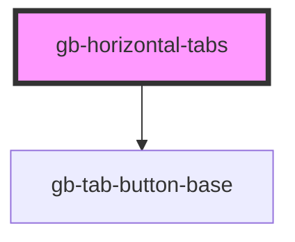

# gb-horizontal-tabs

<!-- Auto Generated Below -->

## Properties

| Property     | Attribute     | Description | Type                                                                                                                                                           | Default     |
| ------------ | ------------- | ----------- | -------------------------------------------------------------------------------------------------------------------------------------------------------------- | ----------- |
| `breakpoint` | `breakpoint`  |             | `"desktop" \| "mobile"`                                                                                                                                        | `undefined` |
| `eigthTab`   | `eigth-tab`   |             | `boolean`                                                                                                                                                      | `false`     |
| `fifthTab`   | `fifth-tab`   |             | `boolean`                                                                                                                                                      | `false`     |
| `fourthTab`  | `fourth-tab`  |             | `boolean`                                                                                                                                                      | `false`     |
| `fullWidth`  | `full-width`  |             | `boolean`                                                                                                                                                      | `false`     |
| `ninthTab`   | `ninth-tab`   |             | `boolean`                                                                                                                                                      | `false`     |
| `seventhTab` | `seventh-tab` |             | `boolean`                                                                                                                                                      | `false`     |
| `sixthTab`   | `sixth-tab`   |             | `boolean`                                                                                                                                                      | `false`     |
| `size`       | `size`        |             | `"lg" \| "md" \| "profile_lg" \| "profile_md" \| "profile_sm" \| "sm" \| "xl" \| "xl2" \| "xl3" \| "xl4" \| "xs" \| "xxs"`                                     | `undefined` |
| `tenthTab`   | `tenth-tab`   |             | `boolean`                                                                                                                                                      | `false`     |
| `thirdTab`   | `third-tab`   |             | `boolean`                                                                                                                                                      | `false`     |
| `type`       | `type`        |             | `"button_gray" \| "button_primary" \| "button_white" \| "button_white_border" \| "line" \| "rounded_button_white_border" \| "underline" \| "underline_filled"` | `undefined` |

## Dependencies

### Depends on

- [gb-tab-button-base](../gb-tab-button-base)

### Graph

----------------------------------------------

*Built with [StencilJS](https://stenciljs.com/)*
