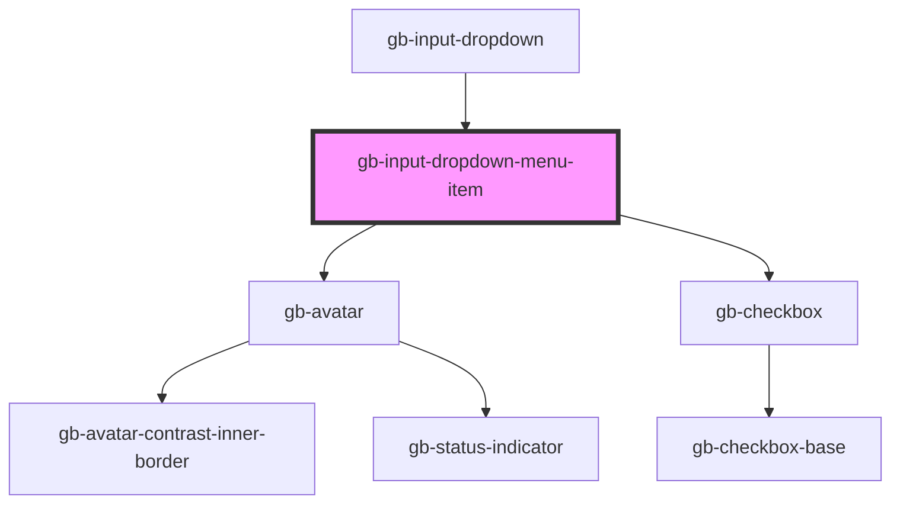

# gb-input-dropdown-menu-item

<!-- Auto Generated Below -->

## Properties

| Property         | Attribute         | Description | Type                                                                                                   | Default     |
| ---------------- | ----------------- | ----------- | ------------------------------------------------------------------------------------------------------ | ----------- |
| `selected`       | `selected`        |             | `boolean`                                                                                              | `false`     |
| `state`          | `state`           |             | `StateEnum.Default \| StateEnum.Disabled`                                                              | `undefined` |
| `supportingText` | `supporting-text` |             | `boolean`                                                                                              | `false`     |
| `type`           | `type`            |             | `"avatar_leading" \| "checkbox" \| "default" \| "dot_leading" \| "icon_leading" \| "search" \| "tags"` | `undefined` |

## Dependencies

### Used by

 - [gb-input-dropdown](../gb-input-dropdown)

### Depends on

- [gb-avatar](../gb-avatar)
- [gb-checkbox](../gb-checkbox)

### Graph

----------------------------------------------

*Built with [StencilJS](https://stenciljs.com/)*
