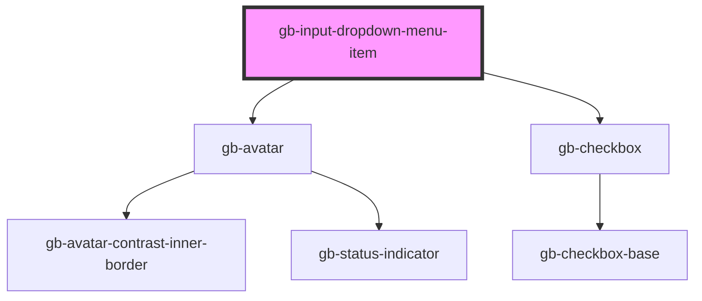

# gb-input-dropdown-menu-item

<!-- Auto Generated Below -->

## Properties

| Property         | Attribute         | Description | Type                                                                | Default     |
| ---------------- | ----------------- | ----------- | ------------------------------------------------------------------- | ----------- |
| `disabled`       | `disabled`        |             | `boolean`                                                           | `false`     |
| `selected`       | `selected`        |             | `boolean`                                                           | `false`     |
| `supportingText` | `supporting-text` |             | `boolean`                                                           | `false`     |
| `type`           | `type`            |             | `"avatar_leading" \| "checkbox" \| "dot_leading" \| "icon_leading"` | `undefined` |
| `value`          | `value`           |             | `string`                                                            | `undefined` |

## Dependencies

### Depends on

- [gb-avatar](../gb-avatar)
- [gb-checkbox](../gb-checkbox)

### Graph

----------------------------------------------

*Built with [StencilJS](https://stenciljs.com/)*
