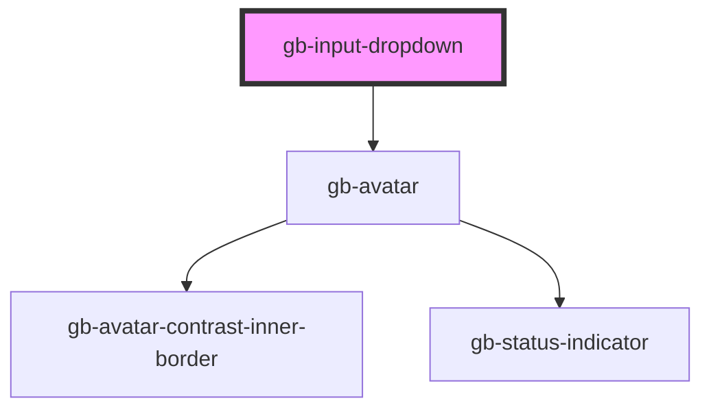

# gb-input-dropdown

<!-- Auto Generated Below -->

## Properties

| Property             | Attribute              | Description | Type                                                                                                              | Default     |
| -------------------- | ---------------------- | ----------- | ----------------------------------------------------------------------------------------------------------------- | ----------- |
| `hintText`           | `hint-text`            |             | `string`                                                                                                          | `''`        |
| `label`              | `label`                |             | `string`                                                                                                          | `''`        |
| `placeholder`        | `placeholder`          |             | `string`                                                                                                          | `''`        |
| `showHelpIcon`       | `show-help-icon`       |             | `boolean`                                                                                                         | `undefined` |
| `showHintText`       | `show-hint-text`       |             | `boolean`                                                                                                         | `undefined` |
| `showLabel`          | `show-label`           |             | `boolean`                                                                                                         | `undefined` |
| `showSupportingText` | `show-supporting-text` |             | `boolean`                                                                                                         | `undefined` |
| `size`               | `size`                 |             | `"lg" \| "md" \| "profile_lg" \| "profile_md" \| "profile_sm" \| "sm" \| "xl" \| "xl2" \| "xl3" \| "xl4" \| "xs"` | `undefined` |
| `state`              | `state`                |             | `"default" \| "disabled"`                                                                                         | `'default'` |
| `type`               | `type`                 |             | `"avatar_leading" \| "dot_leading" \| "icon_leading" \| "search" \| "tags"`                                       | `undefined` |

## Dependencies

### Depends on

- [gb-avatar](../gb-avatar)

### Graph

----------------------------------------------

*Built with [StencilJS](https://stenciljs.com/)*
