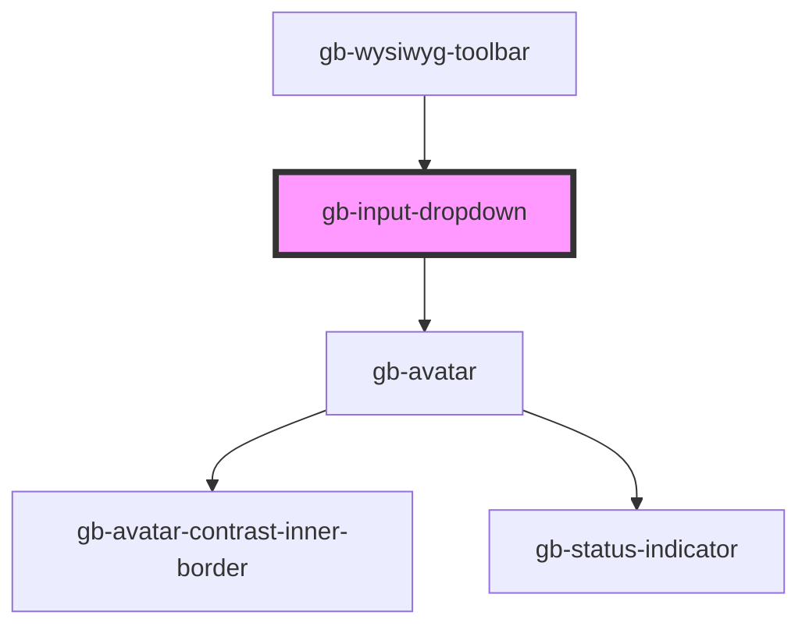

# gb-input-dropdown

<!-- Auto Generated Below -->

## Properties

| Property          | Attribute          | Description | Type                                                                                                                       | Default     |
| ----------------- | ------------------ | ----------- | -------------------------------------------------------------------------------------------------------------------------- | ----------- |
| `hintText`        | `hint-text`        |             | `string`                                                                                                                   | `''`        |
| `iconSwap`        | `icon-swap`        |             | `string`                                                                                                                   | `''`        |
| `label`           | `label`            |             | `string`                                                                                                                   | `''`        |
| `placeholderText` | `placeholder-text` |             | `string`                                                                                                                   | `''`        |
| `showHelpIcon`    | `show-help-icon`   |             | `boolean`                                                                                                                  | `undefined` |
| `showHintText`    | `show-hint-text`   |             | `boolean`                                                                                                                  | `undefined` |
| `showLabel`       | `show-label`       |             | `boolean`                                                                                                                  | `false`     |
| `showPlaceholder` | `show-placeholder` |             | `boolean`                                                                                                                  | `false`     |
| `size`            | `size`             |             | `"lg" \| "md" \| "profile_lg" \| "profile_md" \| "profile_sm" \| "sm" \| "xl" \| "xl2" \| "xl3" \| "xl4" \| "xs" \| "xxs"` | `undefined` |
| `state`           | `state`            |             | `"default" \| "disabled" \| "filled" \| "focused"`                                                                         | `undefined` |
| `type`            | `type`             |             | `"avatar_leading" \| "default" \| "dot_leading" \| "icon_leading" \| "search" \| "tags"`                                   | `undefined` |

## Dependencies

### Used by

 - [gb-wysiwyg-toolbar](../gb-WYSIWYG-toolbar)

### Depends on

- [gb-avatar](../gb-avatar)

### Graph

----------------------------------------------

*Built with [StencilJS](https://stenciljs.com/)*
