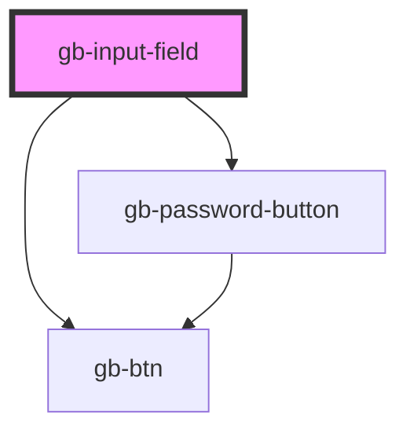

# gb-input-field

<!-- Auto Generated Below -->

## Properties

| Property          | Attribute           | Description | Type                                                                                                                                                                                               | Default     |
| ----------------- | ------------------- | ----------- | -------------------------------------------------------------------------------------------------------------------------------------------------------------------------------------------------- | ----------- |
| `destructive`     | `destructive`       |             | `boolean`                                                                                                                                                                                          | `false`     |
| `hintText`        | `hint-text`         |             | `string`                                                                                                                                                                                           | `''`        |
| `iconSwap`        | `icon-swap`         |             | `string`                                                                                                                                                                                           | `undefined` |
| `inputType`       | `input-type`        |             | `"count" \| "default" \| "icon_leading" \| "leading_dropdown" \| "leading_text" \| "password" \| "password_icon_leading" \| "payment_input" \| "tags" \| "trailing_button" \| "trailing_dropdown"` | `undefined` |
| `label`           | `label`             |             | `string`                                                                                                                                                                                           | `''`        |
| `placeholder`     | `placeholder`       |             | `string`                                                                                                                                                                                           | `''`        |
| `showCloseButton` | `show-close-button` |             | `boolean`                                                                                                                                                                                          | `undefined` |
| `showHelpIcon`    | `show-help-icon`    |             | `boolean`                                                                                                                                                                                          | `false`     |
| `showHintText`    | `show-hint-text`    |             | `boolean`                                                                                                                                                                                          | `undefined` |
| `showLabel`       | `show-label`        |             | `boolean`                                                                                                                                                                                          | `undefined` |
| `showPlaceholder` | `show-placeholder`  |             | `boolean`                                                                                                                                                                                          | `undefined` |
| `showValidation`  | `show-validation`   |             | `boolean`                                                                                                                                                                                          | `undefined` |
| `size`            | `size`              |             | `"lg" \| "md" \| "profile_lg" \| "profile_md" \| "profile_sm" \| "sm" \| "xl" \| "xl2" \| "xl3" \| "xl4" \| "xs" \| "xxs"`                                                                         | `undefined` |
| `state`           | `state`             |             | `"active" \| "disabled" \| "filled" \| "placeholder"`                                                                                                                                              | `undefined` |

## Dependencies

### Depends on

- [gb-btn](../gb-btn)
- [gb-password-button](../gb-password-button)

### Graph

----------------------------------------------

*Built with [StencilJS](https://stenciljs.com/)*
