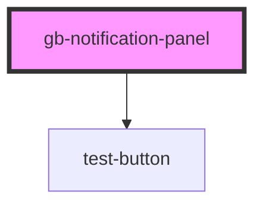

# gb-notification-panel

<!-- Auto Generated Below -->

## Properties

| Property | Attribute | Description | Type                                 | Default     |
| -------- | --------- | ----------- | ------------------------------------ | ----------- |
| `state`  | `state`   |             | `"empty" \| "notification_dropdown"` | `undefined` |

## Dependencies

### Depends on

- [test-button](../test-button)

### Graph

----------------------------------------------

*Built with [StencilJS](https://stenciljs.com/)*
