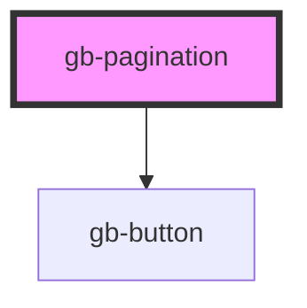

# gb-pagination

<!-- Auto Generated Below -->

## Properties

| Property      | Attribute      | Description | Type                                                                                                                                                                                                                                                                               | Default     |
| ------------- | -------------- | ----------- | ---------------------------------------------------------------------------------------------------------------------------------------------------------------------------------------------------------------------------------------------------------------------------------- | ----------- |
| `breakpoint`  | `breakpoint`   |             | `"desktop" \| "mobile"`                                                                                                                                                                                                                                                            | `undefined` |
| `currentPage` | `current-page` |             | `number`                                                                                                                                                                                                                                                                           | `1`         |
| `shape`       | `shape`        |             | `"circle" \| "square"`                                                                                                                                                                                                                                                             | `undefined` |
| `totalPages`  | `total-pages`  |             | `number`                                                                                                                                                                                                                                                                           | `10`        |
| `type`        | `type`         |             | `"card_button_group_center_aligned" \| "card_button_group_left_aligned" \| "card_button_group_right_aligned" \| "card_default" \| "card_minimal_center_aligned" \| "card_minimal_left_aligned" \| "card_minimal_right_aligned" \| "page_default" \| "page_minimal_center_aligned"` | `undefined` |

## Dependencies

### Depends on

- [gb-button](../gb-button)

### Graph

----------------------------------------------

*Built with [StencilJS](https://stenciljs.com/)*
