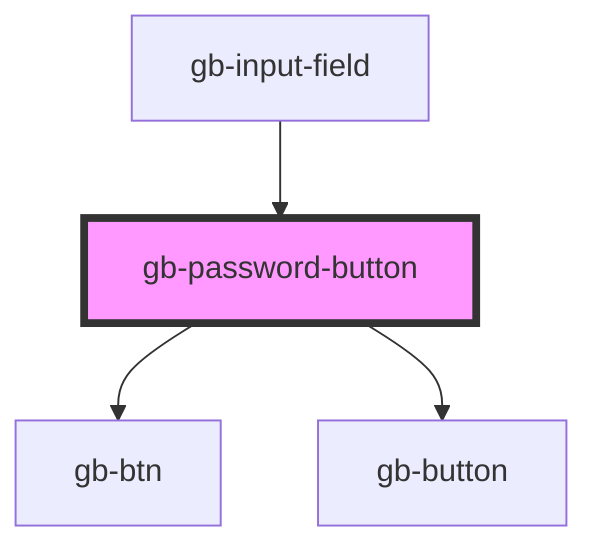

# gb-password-button

<!-- Auto Generated Below -->

## Properties

| Property | Attribute | Description | Type                      | Default     |
| -------- | --------- | ----------- | ------------------------- | ----------- |
| `state`  | `state`   |             | `"default" \| "disabled"` | `undefined` |

## Dependencies

### Used by

 - [gb-input-field](../gb-input-field)

### Depends on

- [gb-btn](../gb-btn)
- [gb-button](../gb-button)

### Graph

----------------------------------------------

*Built with [StencilJS](https://stenciljs.com/)*
