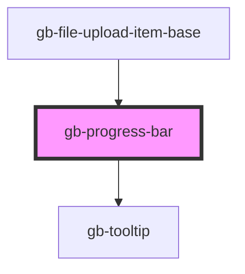

# gb-progress-bar

<!-- Auto Generated Below -->

## Properties

| Property        | Attribute        | Description | Type                                                         | Default     |
| --------------- | ---------------- | ----------- | ------------------------------------------------------------ | ----------- |
| `el`            | --               |             | `HTMLElement`                                                | `undefined` |
| `labelPosition` | `label-position` |             | `"bottom" \| "bottom_floating" \| "right" \| "top_floating"` | `undefined` |
| `progress`      | `progress`       |             | `number`                                                     | `undefined` |
| `showLabel`     | `show-label`     |             | `boolean`                                                    | `false`     |

## Dependencies

### Used by

 - [gb-file-upload-item-base](../gb-file-upload-item-base)

### Depends on

- [gb-tooltip](../gb-tooltip)

### Graph

----------------------------------------------

*Built with [StencilJS](https://stenciljs.com/)*
