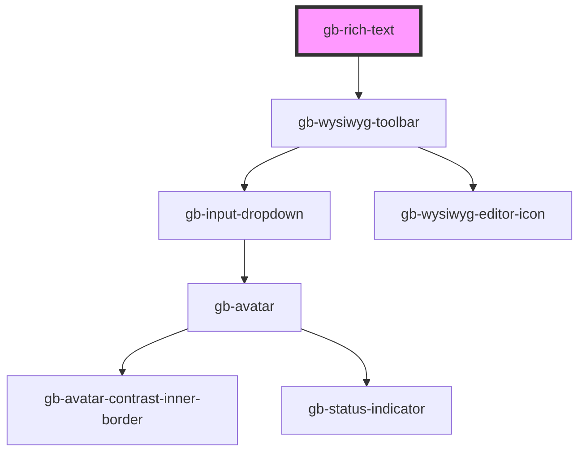

# gb-rich-text

<!-- Auto Generated Below -->

## Properties

| Property          | Attribute          | Description | Type                      | Default     |
| ----------------- | ------------------ | ----------- | ------------------------- | ----------- |
| `destructive`     | `destructive`      |             | `boolean`                 | `undefined` |
| `hintText`        | `hint-text`        |             | `string`                  | `undefined` |
| `label`           | `label`            |             | `string`                  | `undefined` |
| `placeholder`     | `placeholder`      |             | `string`                  | `undefined` |
| `showHintText`    | `show-hint-text`   |             | `boolean`                 | `undefined` |
| `showLabel`       | `show-label`       |             | `boolean`                 | `undefined` |
| `showPlaceholder` | `show-placeholder` |             | `boolean`                 | `undefined` |
| `state`           | `state`            |             | `"default" \| "disabled"` | `undefined` |

## Dependencies

### Depends on

- [gb-wysiwyg-toolbar](../gb-WYSIWYG-toolbar)

### Graph

----------------------------------------------

*Built with [StencilJS](https://stenciljs.com/)*
