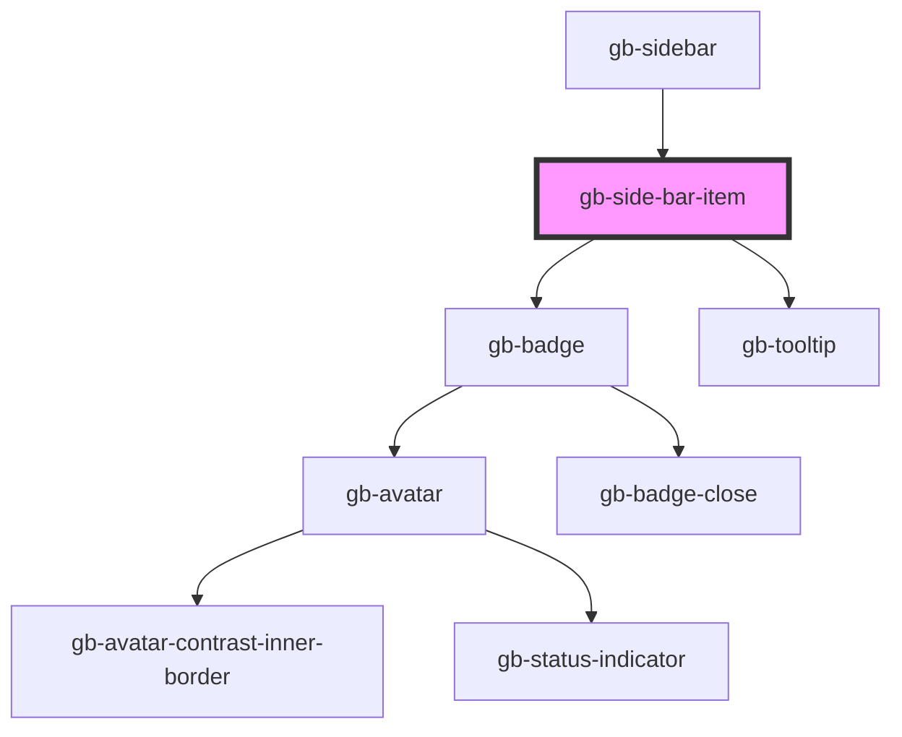

# gb-side-bar-item

<!-- Auto Generated Below -->

## Properties

| Property      | Attribute      | Description | Type                                         | Default     |
| ------------- | -------------- | ----------- | -------------------------------------------- | ----------- |
| `category`    | `category`     |             | `"colored_background" \| "plain_background"` | `undefined` |
| `icon`        | `icon`         |             | `string`                                     | `''`        |
| `label`       | `label`        |             | `string`                                     | `''`        |
| `showArrow`   | `show-arrow`   |             | `boolean`                                    | `false`     |
| `showBadge`   | `show-badge`   |             | `boolean`                                    | `false`     |
| `showTooltip` | `show-tooltip` |             | `boolean`                                    | `false`     |
| `state`       | `state`        |             | `"active" \| "default"`                      | `undefined` |
| `type`        | `type`         |             | `"full_with_label" \| "icon_only"`           | `undefined` |

## Events

| Event                | Description | Type                |
| -------------------- | ----------- | ------------------- |
| `sideBarItemClicked` |             | `CustomEvent<void>` |

## Dependencies

### Used by

 - [gb-sidebar](../gb-sidebar)

### Depends on

- [gb-badge](../gb-badges)
- [gb-tooltip](../gb-tooltip)

### Graph

----------------------------------------------

*Built with [StencilJS](https://stenciljs.com/)*
