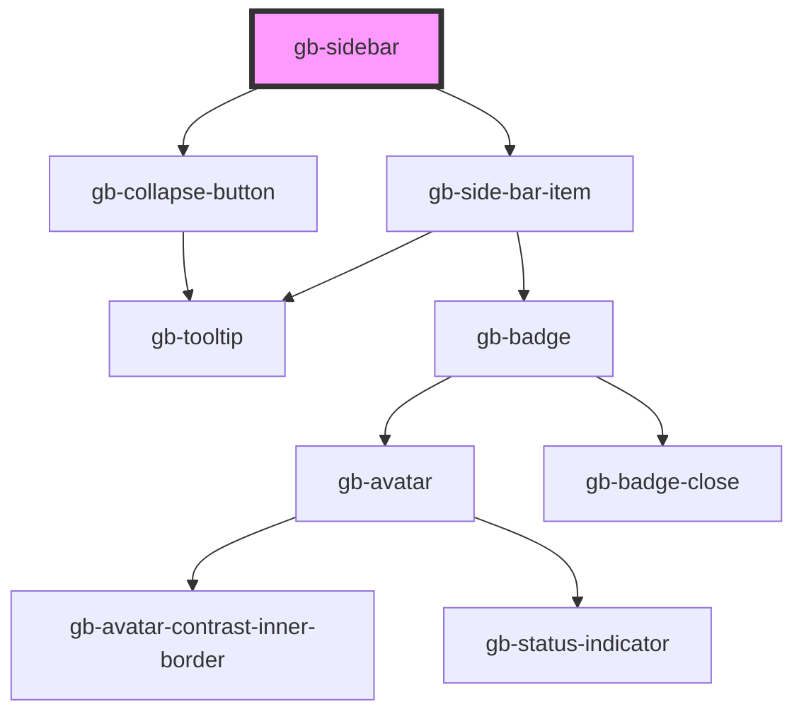

# gb-sidebar

<!-- Auto Generated Below -->

## Properties

| Property             | Attribute              | Description | Type                                         | Default     |
| -------------------- | ---------------------- | ----------- | -------------------------------------------- | ----------- |
| `applicationName`    | `application-name`     |             | `string`                                     | `''`        |
| `category`           | `category`             |             | `"colored_background" \| "plain_background"` | `undefined` |
| `eighthItem`         | `eighth-item`          |             | `boolean`                                    | `false`     |
| `eighthItemIcon`     | `eighth-item-icon`     |             | `string`                                     | `''`        |
| `eighthItemLabel`    | `eighth-item-label`    |             | `string`                                     | `''`        |
| `fifthItem`          | `fifth-item`           |             | `boolean`                                    | `false`     |
| `fifthItemIcon`      | `fifth-item-icon`      |             | `string`                                     | `''`        |
| `fifthItemLabel`     | `fifth-item-label`     |             | `string`                                     | `''`        |
| `firstItemIcon`      | `first-item-icon`      |             | `string`                                     | `''`        |
| `firstItemLabel`     | `first-item-label`     |             | `string`                                     | `''`        |
| `fourthItem`         | `fourth-item`          |             | `boolean`                                    | `false`     |
| `fourthItemIcon`     | `fourth-item-icon`     |             | `string`                                     | `''`        |
| `fourthItemLabel`    | `fourth-item-label`    |             | `string`                                     | `''`        |
| `iconInstance`       | `icon-instance`        |             | `string`                                     | `''`        |
| `label`              | `label`                |             | `string`                                     | `''`        |
| `ninthItem`          | `ninth-item`           |             | `boolean`                                    | `false`     |
| `ninthItemIcon`      | `ninth-item-icon`      |             | `string`                                     | `''`        |
| `ninthItemLabel`     | `ninth-item-label`     |             | `string`                                     | `''`        |
| `secondItemIcon`     | `second-item-icon`     |             | `string`                                     | `''`        |
| `secondItemLabel`    | `second-item-label`    |             | `string`                                     | `''`        |
| `seventhItem`        | `seventh-item`         |             | `boolean`                                    | `false`     |
| `seventhItemIcon`    | `seventh-item-icon`    |             | `string`                                     | `''`        |
| `seventhItemLabel`   | `seventh-item-label`   |             | `string`                                     | `''`        |
| `showSecondCategory` | `show-second-category` |             | `boolean`                                    | `false`     |
| `sixthItem`          | `sixth-item`           |             | `boolean`                                    | `false`     |
| `sixthItemIcon`      | `sixth-item-icon`      |             | `string`                                     | `''`        |
| `sixthItemLabel`     | `sixth-item-label`     |             | `string`                                     | `''`        |
| `state`              | `state`                |             | `"collapsed" \| "expanded"`                  | `undefined` |
| `tenthItem`          | `tenth-item`           |             | `boolean`                                    | `false`     |
| `tenthItemIcon`      | `tenth-item-icon`      |             | `string`                                     | `''`        |
| `tenthItemLabel`     | `tenth-item-label`     |             | `string`                                     | `''`        |
| `thirdItem`          | `third-item`           |             | `boolean`                                    | `false`     |
| `thirdItemIcon`      | `third-item-icon`      |             | `string`                                     | `''`        |
| `thirdItemLabel`     | `third-item-label`     |             | `string`                                     | `''`        |

## Dependencies

### Depends on

- [gb-collapse-button](../gb-collapse-button)
- [gb-side-bar-item](../gb-side-bar-item)

### Graph

----------------------------------------------

*Built with [StencilJS](https://stenciljs.com/)*
