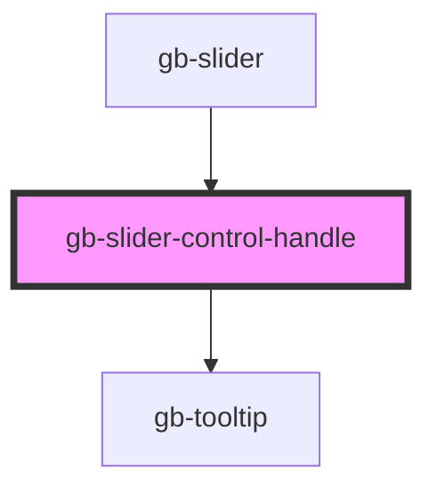

# gb-slider-control-handle

<!-- Auto Generated Below -->

## Properties

| Property | Attribute | Description | Type                  | Default     |
| -------- | --------- | ----------- | --------------------- | ----------- |
| `type`   | `type`    |             | `"text" \| "tooltip"` | `undefined` |
| `value`  | `value`   |             | `number`              | `0`         |

## Dependencies

### Used by

 - [gb-slider](../gb-slider)

### Depends on

- [gb-tooltip](../gb-tooltip)

### Graph

----------------------------------------------

*Built with [StencilJS](https://stenciljs.com/)*
