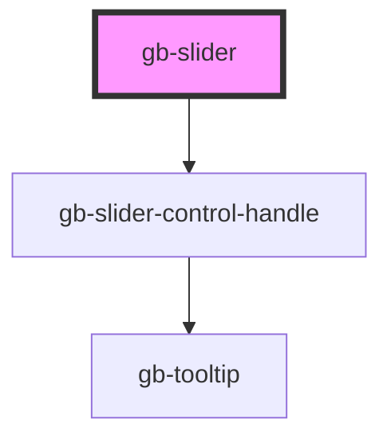

# gb-slider

<!-- Auto Generated Below -->

## Properties

| Property    | Attribute    | Description | Type                  | Default  |
| ----------- | ------------ | ----------- | --------------------- | -------- |
| `max`       | `max`        |             | `number`              | `100`    |
| `min`       | `min`        |             | `number`              | `0`      |
| `thumbType` | `thumb-type` |             | `"text" \| "tooltip"` | `'text'` |

## Events

| Event         | Description | Type                                            |
| ------------- | ----------- | ----------------------------------------------- |
| `valueChange` |             | `CustomEvent<{ left: number; right: number; }>` |

## Dependencies

### Depends on

- [gb-slider-control-handle](../gb-slider-control-handle)

### Graph

----------------------------------------------

*Built with [StencilJS](https://stenciljs.com/)*
