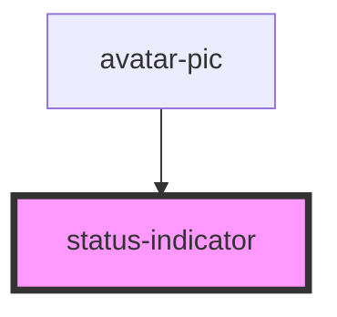

# status-indicator

<!-- Auto Generated Below -->

## Properties

| Property              | Attribute               | Description | Type                                                                       | Default      |
| --------------------- | ----------------------- | ----------- | -------------------------------------------------------------------------- | ------------ |
| `indicatorStateClass` | `indicator-state-class` |             | `string`                                                                   | `this.state` |
| `size`                | `size`                  |             | `"fourxl" \| "lg" \| "md" \| "sm" \| "threexl" \| "twoxl" \| "xl" \| "xs"` | `undefined`  |
| `state`               | `state`                 |             | `"offline" \| "online"`                                                    | `'offline'`  |
| `statusIcon`          | `status-icon`           |             | `string`                                                                   | `''`         |

## Dependencies

### Used by

 - [avatar-pic](../avatar-pic)

### Graph

----------------------------------------------

*Built with [StencilJS](https://stenciljs.com/)*
