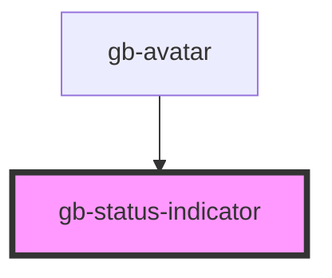

# status-indicator

<!-- Auto Generated Below -->

## Properties

| Property              | Attribute               | Description | Type                                                                                                                       | Default                         |
| --------------------- | ----------------------- | ----------- | -------------------------------------------------------------------------------------------------------------------------- | ------------------------------- |
| `indicatorStateClass` | `indicator-state-class` |             | `string`                                                                                                                   | `this.state`                    |
| `size`                | `size`                  |             | `"lg" \| "md" \| "profile_lg" \| "profile_md" \| "profile_sm" \| "sm" \| "xl" \| "xl2" \| "xl3" \| "xl4" \| "xs" \| "xxs"` | `undefined`                     |
| `state`               | `state`                 |             | `OnlineIndicatorStates.Offline \| OnlineIndicatorStates.Online`                                                            | `OnlineIndicatorStates.Offline` |
| `statusIcon`          | `status-icon`           |             | `string`                                                                                                                   | `''`                            |

## Dependencies

### Used by

 - [gb-avatar](../gb-avatar)

### Graph

----------------------------------------------

*Built with [StencilJS](https://stenciljs.com/)*
