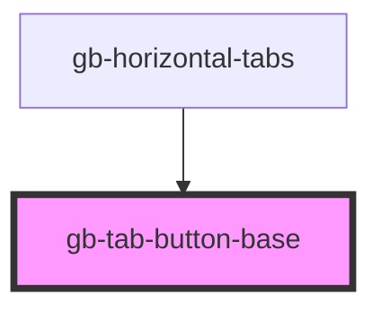

# gb-tab-button-base

<!-- Auto Generated Below -->

## Properties

| Property    | Attribute    | Description | Type                                                                                                                                                           | Default     |
| ----------- | ------------ | ----------- | -------------------------------------------------------------------------------------------------------------------------------------------------------------- | ----------- |
| `badge`     | `badge`      |             | `boolean`                                                                                                                                                      | `false`     |
| `current`   | `current`    |             | `boolean`                                                                                                                                                      | `false`     |
| `fullWidth` | `full-width` |             | `boolean`                                                                                                                                                      | `false`     |
| `size`      | `size`       |             | `"lg" \| "md" \| "profile_lg" \| "profile_md" \| "profile_sm" \| "sm" \| "xl" \| "xl2" \| "xl3" \| "xl4" \| "xs" \| "xxs"`                                     | `undefined` |
| `type`      | `type`       |             | `"button_gray" \| "button_primary" \| "button_white" \| "button_white_border" \| "line" \| "rounded_button_white_border" \| "underline" \| "underline_filled"` | `undefined` |

## Dependencies

### Used by

 - [gb-horizontal-tabs](../gb-horizontal-tabs)

### Graph

----------------------------------------------

*Built with [StencilJS](https://stenciljs.com/)*
