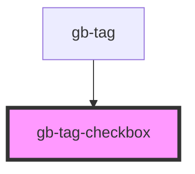

# gb-tag-checkbox

<!-- Auto Generated Below -->

## Properties

| Property   | Attribute  | Description | Type                   | Default |
| ---------- | ---------- | ----------- | ---------------------- | ------- |
| `checked`  | `checked`  |             | `boolean`              | `false` |
| `disabled` | `disabled` |             | `boolean`              | `false` |
| `size`     | `size`     |             | `"lg" \| "md" \| "sm"` | `'md'`  |

## Dependencies

### Used by

 - [gb-tag](../gb-tags)

### Graph

----------------------------------------------

*Built with [StencilJS](https://stenciljs.com/)*
