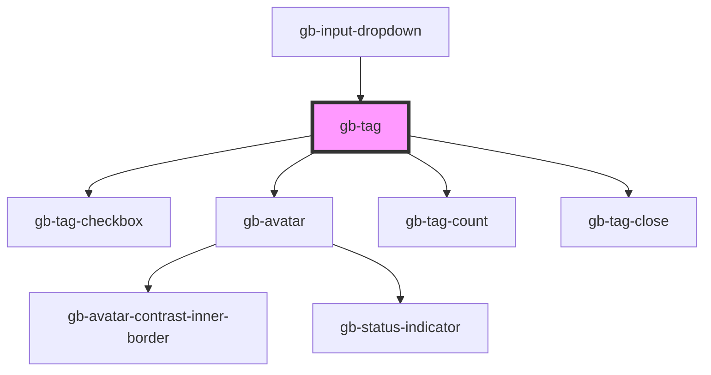

# gb-tag

<!-- Auto Generated Below -->

## Properties

| Property   | Attribute   | Description | Type                                  | Default     |
| ---------- | ----------- | ----------- | ------------------------------------- | ----------- |
| `action`   | `action`    |             | `"X_close" \| "count" \| "text_only"` | `undefined` |
| `checkbox` | `checkbox`  |             | `boolean`                             | `undefined` |
| `flagSwap` | `flag-swap` |             | `string`                              | `undefined` |
| `icon`     | `icon`      |             | `"avatar" \| "country" \| "dot"`      | `undefined` |
| `size`     | `size`      |             | `"lg" \| "md" \| "sm"`                | `undefined` |

## Methods

### `onTagClose() => Promise<void>`

#### Returns

Type: `Promise<void>`

## Dependencies

### Used by

 - [gb-input-dropdown](../gb-input-dropdown)

### Depends on

- [gb-tag-checkbox](../gb-tag-checkbox)
- [gb-avatar](../gb-avatar)
- [gb-tag-count](../gb-tag-count)
- [gb-tag-close](../gb-tag-close)

### Graph

----------------------------------------------

*Built with [StencilJS](https://stenciljs.com/)*
