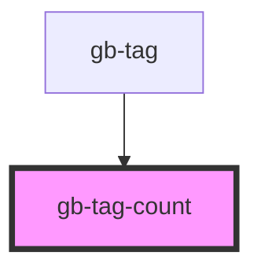

# gb-tag-count

<!-- Auto Generated Below -->

## Properties

| Property | Attribute | Description | Type                                                                                                                       | Default     |
| -------- | --------- | ----------- | -------------------------------------------------------------------------------------------------------------------------- | ----------- |
| `size`   | `size`    |             | `"lg" \| "md" \| "profile_lg" \| "profile_md" \| "profile_sm" \| "sm" \| "xl" \| "xl2" \| "xl3" \| "xl4" \| "xs" \| "xxs"` | `undefined` |

## Dependencies

### Used by

 - [gb-tag](../gb-tags)

### Graph

----------------------------------------------

*Built with [StencilJS](https://stenciljs.com/)*
